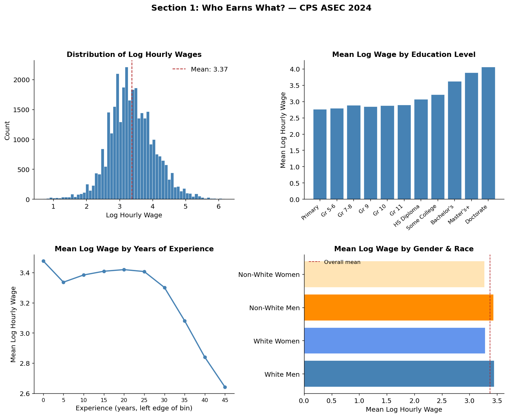
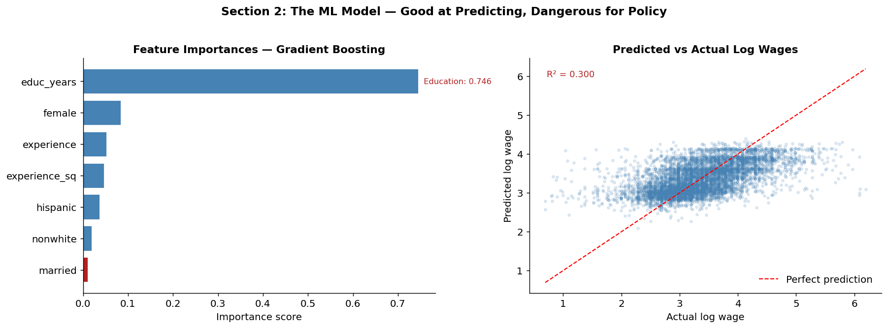
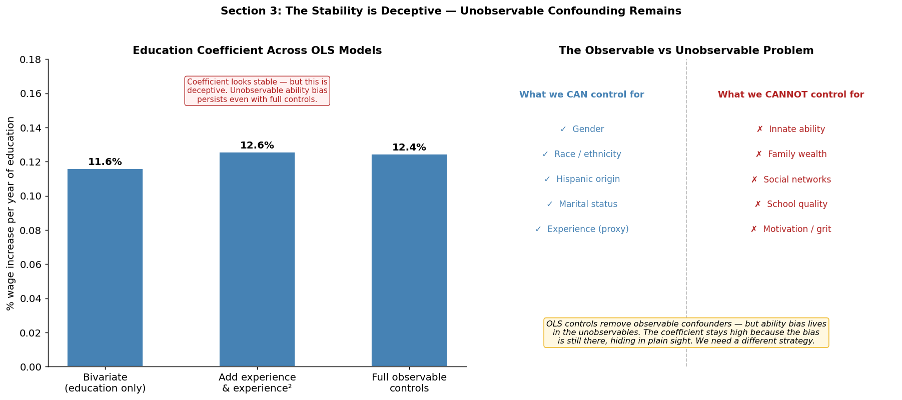
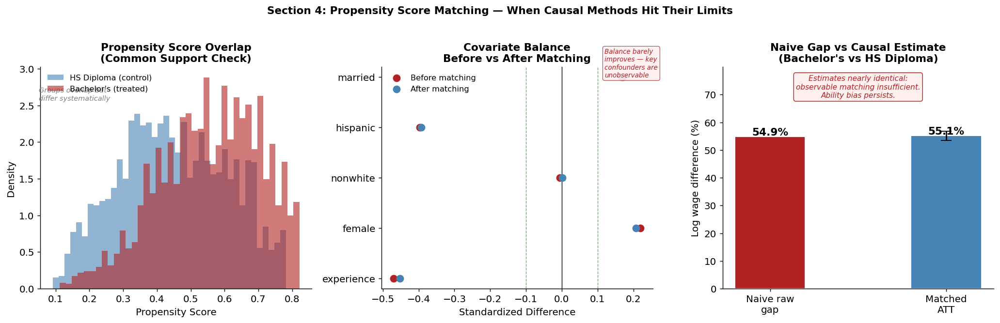
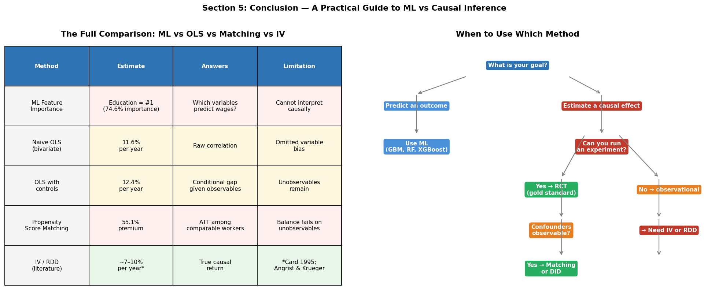

# Prediction vs Causality: Why Your ML Model Can't Tell You What to Do

A data science notebook demonstrating one of the most important — and most commonly violated — boundaries in empirical research: **the difference between prediction and causal inference.**

---

## The Question

A gradient boosting model trained on 32,000 US workers assigns education a **feature importance of 74.6%** — by far the #1 predictor of wages.

Does that mean sending people to college raises their wages by 75%?

**No. This notebook shows exactly why — and what to do instead.**

---

## What You'll Learn

- Why high feature importance does not imply a causal effect
- How omitted variable bias inflates education's apparent impact on wages
- Why adding observable controls often isn't enough
- How propensity score matching works and where it hits its limits
- When to use ML vs OLS vs matching vs instrumental variables

---

## The Data

**Current Population Survey (CPS) ASEC 2024** via [IPUMS CPS](https://cps.ipums.org)  
32,613 prime-age (25–55) wage and salary workers in the United States.

To replicate: register at [ipums.org](https://ipums.org), select CPS ASEC 2024, and request the variables listed in the notebook header.

---

## Section 1: Who Earns What?

We start with exploratory analysis — wage distributions, the education gradient, the experience curve, and gender/race gaps.



Key observations:
- Log wages are roughly normally distributed, justifying the log transformation
- There is a clear, monotonic education gradient — more education, higher wages
- The classic Mincer curve: wages rise steeply with experience, then flatten after ~25 years
- Gender and race gaps persist across all groups

---

## Section 2: The ML Model — Good for prediction, not good for informing policy
We train a gradient boosting model to predict log wages using education, experience, gender, race, and marital status.



**Results:**
- R² = 0.30 which is a reasonable predictive accuracy for wage data with 7 features
- Education dominates feature importances at **74.6%**

ML conclusion: education is the most powerful lever for raising wages. Though there is some truth in that, we cannot make a causal connection just yet.

---

## Section 3: Why the ML Answer Misleads

We run OLS regressions with progressively more controls to test whether the education effect is driven by observable confounders.



**The surprising finding:** the education coefficient barely moves as we add controls:

| Model | Education coefficient | Interpretation |
|---|---|---|
| Bivariate (education only) | 11.6% per year | Raw correlation |
| Add experience & experience² | 12.6% per year | Partial control |
| Full observable controls | 12.4% per year | Best we can do with OLS |

**This stability is deceptive.** It means the key confounders (innate ability, family wealth, school quality, social networks) are simply not in our dataset. No matter how many observable variables we add, the unobservable bias remains. We need very strong assumptions if we are to make a causal connection of education with income.

---

## Section 4: The Causal Fix — And Where It Hits Its Limits

We apply propensity score matching to compare Bachelor's degree holders against HS diploma holders who *look identical* on all observable characteristics.



**Results:**

| | Value |
|---|---|
| Naive raw gap | 54.9% |
| Matched ATT | 55.1% |
| Bias removed | ~0 percentage points |

Matching barely moves the estimate, and balance barely improves. Selection into college is driven by the very unobservables (ability, family background) that propensity score matching cannot touch.

**The honest conclusion:** we cannot credibly estimate the causal return to education with this data and this method. In order to do a rigoruous analysis, we need to rely on IVs that create exogenous variation in education independent of ability. Examples include compulsory schooling laws, proximity to college etc. 

---

## Section 5: The Full Picture and a Practical Guide



### Summary of all methods

| Method | Education estimate | What it answers | Key limitation |
|---|---|---|---|
| ML feature importance | 74.6% importance score | Which variables predict wages? | Not a causal quantity |
| Naive OLS | 11.6% per year | Raw correlation | Omitted variable bias |
| OLS with controls | 12.4% per year | Conditional gap given observables | Unobservables remain |
| Propensity score matching | 55.1% BA premium | ATT among comparable workers | Balance fails on unobservables |
| IV / RDD (from literature) | ~7–10% per year | True causal return | Requires exogenous variation |

The raw Bachelor's wage premium is real — people with degrees do earn more. We must be wary about the selection bias which is actually telling us *who goes to college*, instead of *what college does to them*. The literature's best causal estimates put the true return at 7–10% per year (Card 1995; Angrist & Krueger 1991) — meaningfully lower than the 55% raw premium.

### When to use which method

| Your goal | Use this | Why |
|---|---|---|
| Predict who will earn more | ML (GBM, RF, XGBoost) | Maximizes predictive accuracy |
| Estimate effect of a policy | RCT if possible | Eliminates selection bias |
| Observational, confounders observable | Matching, DiD | Disciplines the comparison |
| Observational, confounders unobservable | IV, RDD | Exploits exogenous variation |
| You used ML and called it causal | ⚠️ Start over | The result is not trustworthy |

---

## How to Run

```bash
git clone https://github.com/umernaeem1/prediction-vs-causality
cd prediction-vs-causality
pip install -r requirements.txt
jupyter notebook
```

Open `prediction_vs_causality.ipynb` and run all cells top to bottom.

---

## Requirements

```
pandas>=2.0
numpy>=1.24
matplotlib>=3.7
seaborn>=0.12
scikit-learn>=1.3
statsmodels>=0.14
scipy>=1.11
jupyter>=1.0
```

---

## Background

This notebook was built applying econometric thinking to modern ML workflows. The author is a PhD student in Economics at the University of Illinois Chicago with a background in program evaluation, causal inference, and large-scale field research.

**Key references:**
- Card, D. (1995). Using geographic variation in college proximity to estimate the return to schooling.
- Angrist, J. & Krueger, A. (1991). Does compulsory school attendance affect schooling and earnings?
- Cunningham, S. (2021). [Causal Inference: The Mixtape](https://mixtape.scunning.com) *(free online)*
- Huntington-Klein, N. (2021). [The Effect](https://theeffectbook.net) *(free online)*

---

*If this was useful, the two free textbooks above are the best next step for learning causal inference properly.*